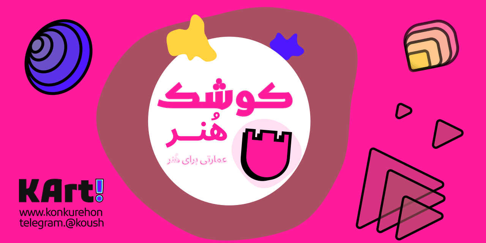

# 🏰 Koushk Art Project


**Koushk Honar** is a comprehensive and specialized platform for Iranian university art entrance exam applicants and art students. Our goal is to provide deep, practical, and inspiring educational content to support the next generation of artists in Iran.

---

## 💎 Our Vision, Mission, and Values

*   **Vision:** To become the most trusted and primary online reference for education, counseling, and guidance on the path to Iran's art universities.
*   **Mission:** We simplify the complex journey of the art entrance exam for applicants by producing high-quality, standardized, and experience-based content, preparing them for entry into the professional art world.
*   **Values:**
    1.  **Authenticity & Quality:** A commitment to delivering accurate, in-depth, and practical content.
    2.  **Community-Centric:** Building a dynamic community of students and mentors for knowledge exchange.
    3.  **Innovation:** Leveraging the best tools and methods for online education.

---

## 🎯 Content Strategy

This project operates on the **Hub & Spoke** content model. Our strategy is based on the monthly publication of one **Hub content (a comprehensive pillar page)** and several **Cluster contents (supporting articles)**. Additionally, to maintain site dynamism, **three articles will be published weekly**.

- **Primary Goal:** To provide comprehensive guides (Pillar Content) and cover related topics fully (Cluster Content) to achieve top rankings in search engines.
- **Feedback:** We continuously gather user feedback and use it to improve and expand our content.

---

## 🛠️ Tech Stack

This project is built using a modern web stack to deliver the best user experience and performance.

- **Core Framework:** [**Next.js**](https://nextjs.org/) (App Router)
- **Programming Language:** [**TypeScript**](https://www.typescriptlang.org/)
- **UI Library:** [**Mantine**](https://mantine.dev/)
- **Content Management:** **MDX** files within the Git repository
- **Testing:** [**Jest**](https://jestjs.io/) & [**Testing Library**](https://testing-library.com/)
- **Code Quality:** [**ESLint**](https://eslint.org/) & [**Prettier**](https://prettier.io/)
- **Component Documentation:** [**Storybook**](https://storybook.js.org/)
- **Package Manager:** [**Yarn Berry**](https://yarnpkg.com/)
- **Deployment Platform:** [**Vercel**](https://vercel.com/)

---

## 🚀 Getting Started

To set up this project locally, follow the steps below:

1.  **Clone the repository:**
    ```bash
    git clone https://github.com/koushk-art/kb.git
    cd kb
    ```

2.  **Install dependencies:**
    ```bash
    yarn install
    ```

3.  **Run the development server:**
    ```bash
    yarn dev
    ```

You can now view the project at `http://localhost:3000`.

---

## 🤝 Contributing

We welcome contributions to this project! Please read our `CONTRIBUTING.md` file for more information.
